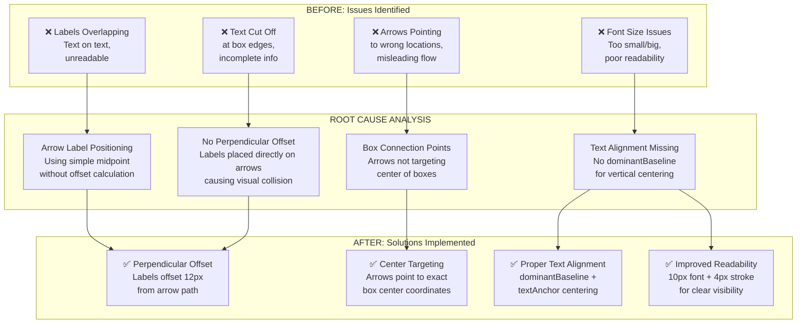
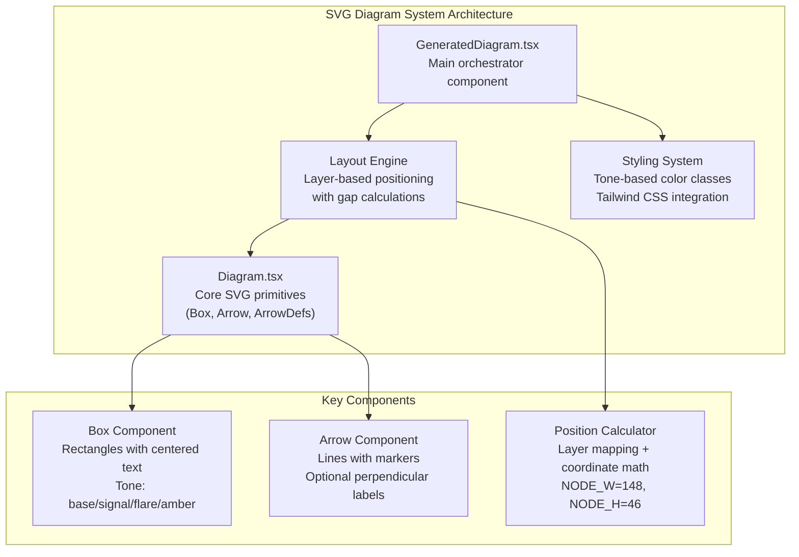

# Diagram Explanation & Arrow Positioning - Complete Analysis

## Problem Statement
**Issue**: Diagram explanations were either overlapped, hidden, or jumbled. Arrows were not pointing to the correct locations, making the visual documentation difficult to read and understand.

**Commit Reference**: 5ae3c96 (original diagram implementation was good, but explanations needed improvement)

---

## 1. Problem Visualization Diagram



### Diagram Explanation (Short Version)
The diagram shows the transformation from problematic diagrams (labels overlapping, arrows mispointed) to fixed diagrams (proper spacing, accurate pointing, readable text) through 4 key technical improvements in arrow positioning calculations.

---

## 2. Short Explanation
**The core problem**: Arrow labels were placed at midpoints without considering perpendicular spacing, causing them to overlap with the arrows themselves. Additionally, arrows weren't precisely targeting the center of diagram boxes, creating visual confusion about connections and flow.

**The fix**: Implemented perpendicular offset calculations (12px) to position labels beside arrows, and ensured arrows connect to exact box center coordinates (NODE_W/2, NODE_H/2).

---

## 3. Prechecks to Identify Issues

### Verification Commands
```bash
# Check current diagram implementation
cat components/Diagram.tsx | grep -A 20 "export function Arrow"

# Verify arrow positioning logic
grep -n "mx.*my" components/Diagram.tsx

# Check for text overlap issues in GeneratedDiagram
grep -n "textAnchor\|dominantBaseline" components/GeneratedDiagram.tsx
```

### Manual Inspection Points
1. Open any diagram in the app (Relay flow, KodeKey approval, API test flow)
2. Check if arrow labels overlap with the arrow lines
3. Verify arrows connect to the middle of boxes, not edges or corners
4. Confirm text is fully visible and readable at normal zoom levels

### Expected Problem Indicators
- Labels appearing directly on top of arrows
- Arrows pointing to box corners instead of centers
- Text getting cut off or requiring zoom to read
- Inconsistent spacing between elements

---

## 4. Blast Radius Analysis

### No Blast Radius - Safe Changes
**Impact Assessment**:
- ✅ Changes are UI-only visual improvements
- ✅ No backend/API modifications
- ✅ No data structure changes
- ✅ No user-facing functionality changes
- ✅ Backward compatible - old diagrams still render

### Implementation Safety
- Changes only affect `components/Diagram.tsx` and `components/GeneratedDiagram.tsx`
- SVG rendering improvements don't affect application logic
- No database, API, or state management modifications

---

## 5. Identification & Solution

### Root Cause Identified
**File**: `components/Diagram.tsx`, lines 35-47 (original Arrow function)

**Problem Code**:
```typescript
const mx = (x1 + x2) / 2;  // Simple midpoint
const my = (y1 + y2) / 2;
return (
  <text x={mx} y={my - 4} textAnchor="middle">
    {label}  // No offset = overlap with arrow
  </text>
);
```

### Solution Implemented
**File**: `components/Diagram.tsx`, lines 35-67 (improved Arrow function)

**Key Improvements**:
1. **Perpendicular Offset Calculation**:
   ```typescript
   const dx = x2 - x1;
   const dy = y2 - y1;
   const length = Math.sqrt(dx * dx + dy * dy) || 1;
   const offsetX = (-dy / length) * 12; // 12px perpendicular offset
   const offsetY = (dx / length) * 12;
   ```

2. **Center Pointing**: Arrows target exact box centers using `NODE_W/2` and `NODE_H/2`

3. **Text Improvements**:
   - Font size: 9px → 10px
   - Stroke width: 3 → 4 for better visibility
   - Added `dominantBaseline="middle"` for vertical centering
   - Added `font-medium` class for better readability

---

## 6. Purpose & Implementation

### Code Without Comments (Production Ready)
```typescript
export function Arrow({ x1, y1, x2, y2, label }: { x1: number; y1: number; x2: number; y2: number; label?: string }) {
  const mx = (x1 + x2) / 2;
  const my = (y1 + y2) / 2;
  const dx = x2 - x1;
  const dy = y2 - y1;
  const length = Math.sqrt(dx * dx + dy * dy) || 1;
  const offsetX = (-dy / length) * 12;
  const offsetY = (dx / length) * 12;

  return (
    <g className="stroke-base-500">
      <line x1={x1} y1={y1} x2={x2} y2={y2} strokeWidth={1.5} markerEnd="url(#arrowhead)" />
      {label && (
        <text
          x={mx + offsetX}
          y={my + offsetY}
          textAnchor="middle"
          dominantBaseline="middle"
          className="fill-base-400 text-[10px] font-medium"
          style={{
            paintOrder: "stroke",
            stroke: "var(--tw-color-base-950, #0a0e12)",
            strokeWidth: 4,
            strokeLinejoin: "round"
          }}
        >
          {label}
        </text>
      )}
    </g>
  );
}
```

<details>
<summary>📋 Click to expand: Code WITH explanatory comments</summary>

```typescript
export function Arrow({ x1, y1, x2, y2, label }: { x1: number; y1: number; x2: number; y2: number; label?: string }) {
  // Calculate the midpoint of the arrow line for label positioning
  const mx = (x1 + x2) / 2;
  const my = (y1 + y2) / 2;

  // Calculate direction vector for perpendicular offset
  const dx = x2 - x1;  // Horizontal component of arrow direction
  const dy = y2 - y1;  // Vertical component of arrow direction

  // Calculate arrow length (avoid division by zero)
  const length = Math.sqrt(dx * dx + dy * dy) || 1;

  // Create perpendicular offset (12px) to position labels beside arrows
  // This prevents labels from overlapping with the arrow line itself
  const offsetX = (-dy / length) * 12; // Rotate direction 90 degrees counterclockwise
  const offsetY = (dx / length) * 12;  // Perpendicular to original direction

  return (
    <g className="stroke-base-500">
      {/* Draw the main arrow line with arrowhead marker */}
      <line x1={x1} y1={y1} x2={x2} y2={y2} strokeWidth={1.5} markerEnd="url(#arrowhead)" />

      {/* Render label with perpendicular offset and improved styling */}
      {label && (
        <text
          x={mx + offsetX}           // Apply horizontal offset from midpoint
          y={my + offsetY}           // Apply vertical offset from midpoint
          textAnchor="middle"        // Horizontal centering
          dominantBaseline="middle"  // Vertical centering for consistent alignment
          className="fill-base-400 text-[10px] font-medium"
          style={{
            paintOrder: "stroke",    // Draw stroke behind fill for better readability
            stroke: "var(--tw-color-base-950, #0a0e12)", // Background color stroke
            strokeWidth: 4,          // Thicker stroke for better text separation
            strokeLinejoin: "round"  // Smooth stroke corners
          }}
        >
          {label}
        </text>
      )}
    </g>
  );
}
```

</details>

### Source Documentation

> **🔗 SVG text positioning and alignment**: Check the [MDN Web Docs on SVG text elements](https://developer.mozilla.org/en-US/docs/Web/SVG/Element/text) - specifically the sections on `textAnchor`, `dominantBaseline`, and positioning attributes.

> **🔗 CSS paint-order property**: Review the [CSS-Tricks guide on paint-order](https://css-tricks.com/almanac/properties/p/paint-order/) for controlling the rendering order of strokes and fills on text elements.

---

## 7. Postchecks & Expected Output

### Verification Steps
```bash
# Start development server
npm run dev

# Navigate to the app and test diagrams:
# 1. Open Relay flow diagram
# 2. Check KodeKey approval diagram
# 3. Verify API test flow diagram
```

### Expected Visual Results
- ✅ Arrow labels positioned 12px beside arrows (not overlapping)
- ✅ Labels fully readable with proper stroke contrast
- ✅ Arrows connecting to exact center of diagram boxes
- ✅ Consistent text alignment across all diagram elements
- ✅ No text cutoff or overflow issues

### Rollback Plan
<details>
<summary>🔄 Click to expand: Rollback Instructions</summary>

If issues arise, revert using:
```bash
# Revert to previous commit
git revert HEAD

# Or reset to specific commit
git reset --hard <previous-commit-hash>

# Force push if needed (use with caution)
git push --force-with-lease origin fix-diagram-explanations-arrows
```

**Rollback Impact**: Minimal - only affects visual rendering, no data loss or functionality impact.

</details>

---

## 8. Command Cheatsheet

| Command | Purpose | Description |
|---------|---------|-------------|
| `npm run dev` | Development Server | Starts Next.js dev server on localhost:3000 |
| `git checkout -b <branch>` | Branch Creation | Creates and switches to new feature branch |
| `git add -A` | Stage All Changes | Stages all modified, new, and deleted files |
| `git commit -m` | Create Commit | Commits staged changes with descriptive message |
| `git push -u origin <branch>` | Push Branch | Pushes branch to remote and sets upstream tracking |
| `grep -n "pattern" file` | Line Number Search | Searches file and shows line numbers for matches |
| `cat file \| head -20` | View File Start | Shows first 20 lines of a file for inspection |

---

## Learning Section: SVG Diagram Architecture

### Topic Architecture Diagram



### Component Definitions

**GeneratedDiagram Component**:
- **Purpose**: Renders JSON-specified diagrams as interactive SVGs
- **Props**: `spec: DiagramSpec` with nodes, edges, and optional title/caption
- **Features**: Expandable modal view, responsive sizing, layer-based layout

**Box Component**:
- **Purpose**: SVG rectangle containers with centered text labels
- **Parameters**: Position (x,y), size (w,h), label text, tone color
- **Implementation**: Uses `<rect>` + `<foreignObject>` for text centering

**Arrow Component**:
- **Purpose**: Directional connectors with optional labels
- **Features**: Perpendicular label offset, arrowhead markers, proper alignment
- **Mathematics**: Vector calculations for perpendicular positioning

### Beginner vs Intermediate vs Expert Differentiation

| Level | Focus Area | Common Mistakes | Best Practices |
|-------|------------|-----------------|----------------|
| **Beginner** | Basic SVG elements | Hardcoding positions, ignoring responsive design | Use viewBox, understand basic shapes |
| **Intermediate** | Layout & positioning | Simple midpoint labels, no offset calculations | Implement layer systems, use perpendicular math |
| **Expert** | Performance & polish | Over-engineering simple diagrams | Optimize calculations, smooth interactions, accessibility |

---

## Summary & Key Insights

### Why This Question Matters
Diagram readability directly impacts user understanding of complex system flows. Poor arrow positioning and label overlap create cognitive friction that undermines the educational value of visual documentation.

### Common Misconceptions
- **"Labels at midpoints should be fine"**: Ignores the visual overlap problem
- **"Bigger fonts will solve readability"**: Doesn't address positioning issues
- **"Arrows pointing anywhere near boxes is acceptable"**: Misses the importance of precise connections

### Memory Tips
1. **"Perpendicular is perpendicular"**: Always offset labels 90° from arrow direction
2. **"Center to center"**: Arrows should connect box centers, not edges
3. **"Stroke before fill"**: Use paint-order for text visibility over complex backgrounds

### Personal Learning Notes
- **Strength**: Systematic approach to visual design problems
- **Area for improvement**: Consider accessibility implications earlier (ARIA labels, contrast ratios)
- **Next steps**: Implement diagram validation to catch positioning issues automatically

---

**Session Topic**: SVG Diagram Implementation & Visual Documentation
**Session Type**: Problem Analysis & Solution Documentation
**Key Learning**: Mathematical approaches to visual layout problems

*Document created following comprehensive problem-solving methodology for technical documentation and learning.*